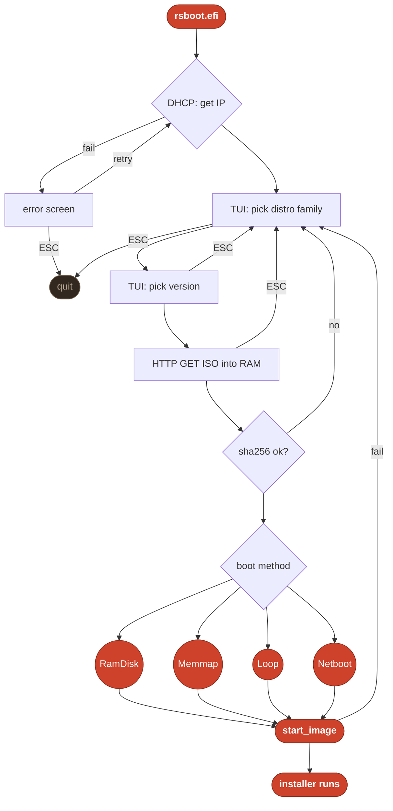

# rsboot
---
>**A diskless UEFI OS installer, written in Rust.**

>**rsboot** is a UEFI application (`no_std`) that brings up the network, presents a TUI of
>Linux/BSD distributions, downloads the chosen installer ISO straight into RAM over
>HTTP, verifies its checksum, and boots it. 
>
>Doesn't need a disk (you can just download a distro and check it out, to install it, you need a disk). 
>
>Can be shipped via any bootable media (CD,USB,etc), via a PXE server (see phase2), or **_possibly_** directly flashed into the firmware.

> **Bachelor thesis project.** 
> Most UEFI apps are written in `C`, **rsboot** is an argument that
> Rust makes a _safer_, more modern alternative for uefi/driver level software.
---
## Main Workflow

1. **DHCP**: acquire an IP before the menu is shown (retry on failure, ESC to quit).
2. **TUI**: a menu with 2 stages (distro family -> version).
3. **Download**: stream the ISO into a RAM buffer over HTTP (page-aligned to be recognised as **virtualCD** or **persistent memory**) 
with a live progress bar and ESC-to-abort.
4. **Verify**: sha256 integrity check (catches corrupt downloads).
5. **Boot**: hand off to the installer using the right boot method for the OS.



### Boot methods

Different distros expect their install media in different ways, so **rsboot** picks one of:

| Method          | How it boots                                                                                  | Used by                |
| --------------- | --------------------------------------------------------------------------------------------- | ---------------------- |
| `RamDisk`       | Register the ISO as a **virtual CD**, load and start BOOTX64                                  | Debian/RHEL based, BSD |
| `Memmap`        | Expose the ISO as **persistent memory**, load and start the **kernel** directly via **memmap** | Arch based             |
| `LoopInjection` | Append the ISO + a hook into the **initramfs cpio**                                           | Gentoo                 |
| `Netboot`       | Load a **.efi** directly                                                                      | NixOS                  |

---
## Quick start

```sh
# build the .efi and copy it into the QEMU ESP
# make flags:  ARCH=aarch64 RELEASE=1 | defaults x86_64, 0(debug)
cd efi && make install

# host some ISOs locally (QEMU maps 10.0.2.2 to host)
python3 -m http.server 8000 --directory <dir-with-isos>

# boot it 
# make flags: MEM=4G NOGRAPHIC=1 | defaults: 2G, 0(graphical)
cd ../qemu && make run-app 
```

See [`efi/README.md`](efi/README.md) for build details and [`qemu/README.md`](qemu/README.md) for the test setup.

---
## Status

### Phase 1: ISO loading 

- [x] TUI menu (distro family → version)
- [x] DHCP + HTTP download straight into RAM
- [x] All four boot methods: `RamDisk`, `Memmap`, `LoopInjection`, `Netboot`
- [x] sha256 integrity verification
- [x] On-device OS catalog
- [x] `aarch64` support

> Written to keep as much memory safety as possible. 

### Phase 2: self-hosted network boot

- [x] PXE/DHCP container serving `rsboot.efi`
- [x] HTTP mirror container for the OS images
- [ ] Fetch the catalog at runtime, same format as [`os_list`](efi/assets/os_list), with the bundled one kept as a fallback
- [ ] VPS hosting the mirror + a small Python cron job, **only** for Latest-edition/rolling-release distros 
- [ ] End-to-end boot test for every distro

> Local **minimal** setup (dnsmasq + nginx, bare-metal or Docker) lives in
> [`homelab/README.md`](homelab/README.md); test it under QEMU with `make run-pxe ([`qemu/README.md`](qemu/README.md)).

### Firmware embedding, experimental, works on EDK2 TianoCore, tested with QEMU

- [x] Embed `rsboot.efi` into an OVMF/edk2 build as its own boot option 
- [x] Python script that applies every edk2 edit for you
- [ ] Flashing an actual motherboard with it

>Guide in [`firmware-embed/README.md`](firmware-embed/README.md)

>Full Status breakdown in [`docs/README.md`](docs/README.md).

